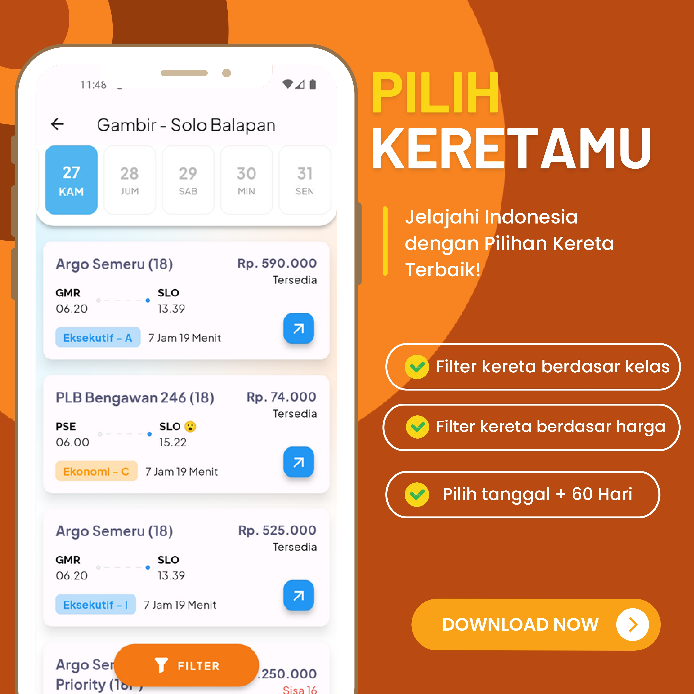
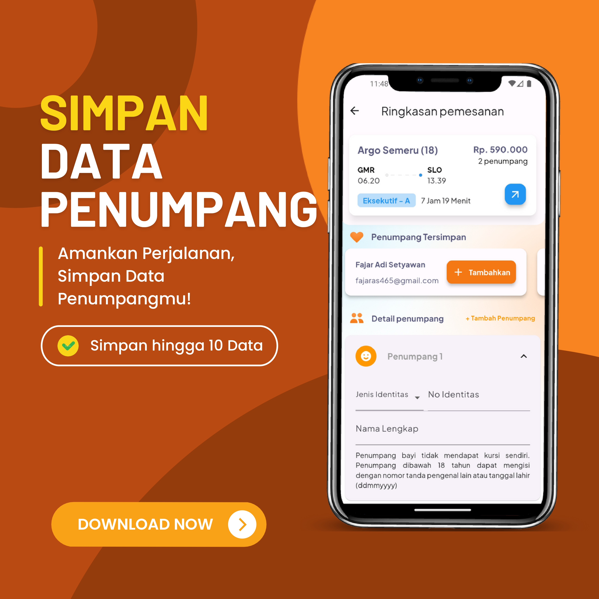
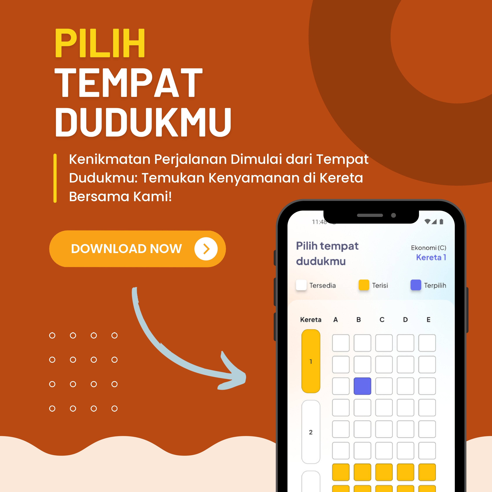

# Train Ticketing

## Sliceing Design from Figma [By fafaaye](https://www.figma.com/community/file/885208153538485987/Train-Ticketing-App-UI).

#### Package Used
* Uses [GetX Pattern](https://pub.dev/packages/get) for architecture pattern.
* Uses [Easy Date Timeline](https://pub.dev/packages/easy_date_timeline) for date horizontal scroll.
* Uses [intl](https://pub.dev/packages/intl) for date formater.

#### Screenshoot

 
<table style="width:100%">
  <tr>
    <td align="center"></td>
  </tr>
  <tr>
    <td align="center"></td>
  </tr>
   <tr>
    <td align="center"></td>
  </tr>
  <tr>
    <td align="center"></td>
  </tr>
  <tr>
    <td align="center"></td>
  </tr>
</table>

